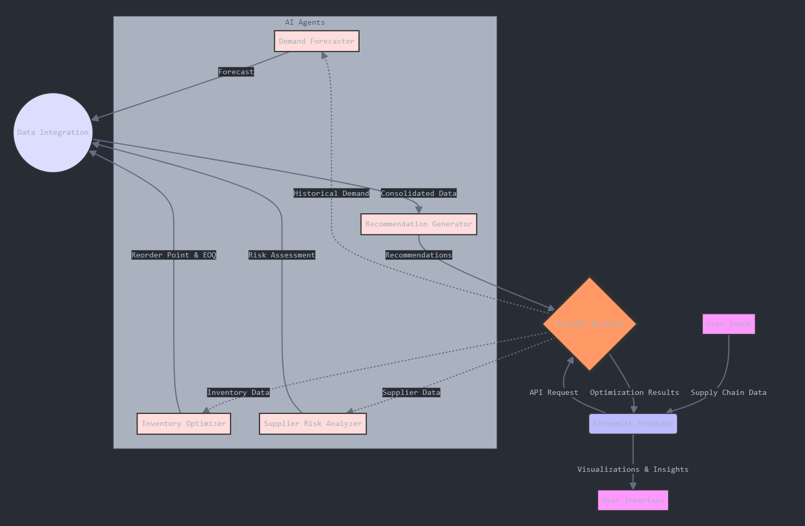

# How_I_Built_Supply_Chain_Optimization_Using_AI_Agent
How I Built Supply Chain Optimization Using AI Agents

## Introduction

Full Article : [https://medium.com/@learn-simplified/how-about-an-ai-agent-that-builds-complete-software-projects-all-local-8ddda106011c

Have you ever wondered how big companies keep their shelves stocked just right, not too much, not too little? Well, I did, and that curiosity led me down a fascinating path. I'm about to tell you how I built a supply chain optimization system using AI agents. It's like teaching a computer to be the world's best stock manager, but for an entire company's inventory!


## Whats This Project About

This article is a deep dive into how I created a smart system to help businesses manage their supply chains better. I'll walk you through the process of building AI agents that can forecast demand, optimize inventory levels, analyze supplier risks, and even generate recommendations.
Imagine a crystal ball that not only predicts how much of a product you'll need next month but also tells you when to order more and how muchthat's essentially what this system does. We'll look at the code behind these AI agents and how they work together to create a powerful tool for businesses.

## Why Work on It?

In today's fast-paced business world, AI isn't just a buzzwordit's becoming a necessity. This article shows you, through the lens of a fictional company called OptChain Solutions, how AI can be implemented to solve real-world supply chain problems.
Whether you're a business owner looking to streamline operations, a developer interested in AI applications, or just someone curious about how modern businesses run, this article has something for you. You'll get a behind-the-scenes look at how AI can crunch numbers, predict trends, and offer insights that can save companies millions. It's a peek into the future of business operations, and trust me, it's pretty exciting!


## Architecture



# Tutorial: How I Built Supply Chain Optimization Using AI Agents

## Prerequisites
- Python installed on your system.
- A basic understanding of virtual environments and command-line tools.

## Steps

1. **Virtual Environment Setup:**
   - Create a dedicated virtual environment for our project:
   
     ```bash
     python -m venv How_I_Built_Supply_Chain_Optimization_Using_AI_Agent
     ```
   - Activate the environment:
   
     - Windows:
       ```bash
       How_I_Built_Supply_Chain_Optimization_Using_AI_Agent\Scripts\activate
       ```
     - Unix/macOS:
       ```bash
       source How_I_Built_Supply_Chain_Optimization_Using_AI_Agent/bin/activate
       ```
   
# Installation and Setup Guide

**Install Project Dependencies:**

Follow these steps to set up and run the 'Supply Chain Optimization Using AI Agents' project:

1. Navigate to your project directory:
   ```
   cd path/to/your/project
   ```
   This ensures you're in the correct location for the subsequent steps.

2. Install the required dependencies:
   ```
   pip install -r requirements.txt
   ```
   This command installs all the necessary Python packages listed in the requirements.txt file.


## Run - How I Built Supply Chain Optimization Using AI Agents

   ```bash 
      # Run Payment Gateway FAST API
      python -m backend.main
      
      # Run Payment Gateway FAST API
      streamlit run frontend\streamlit_app.py
      
   ```


